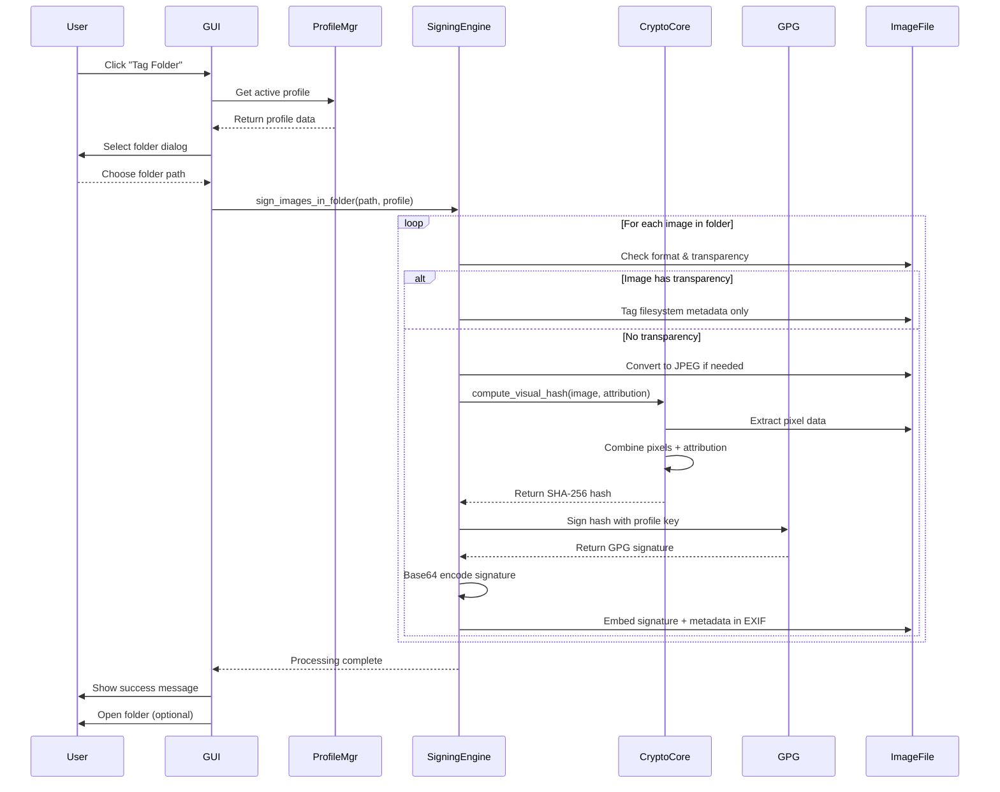
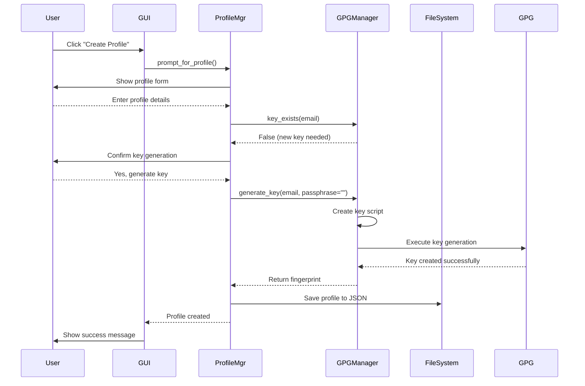
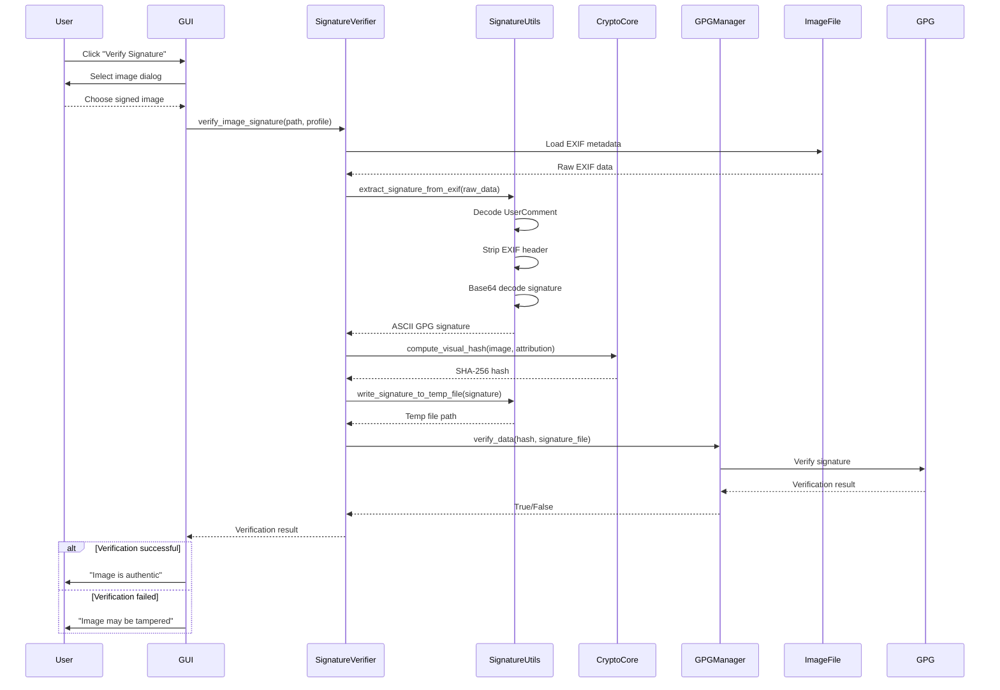
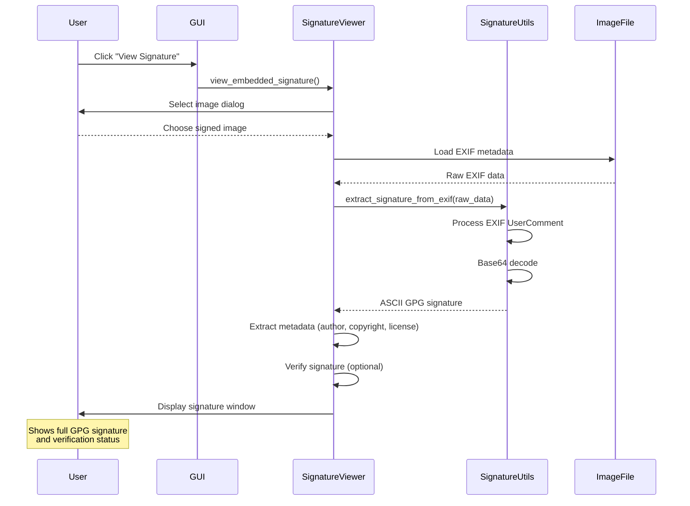

# ImageIP - Digital Rights Management & Image Signing Tool


ImageIP is a comprehensive digital rights management tool for photographers and content creators. It enables users to embed cryptographic signatures and copyright metadata directly into their images, providing tamper-evident protection and clear attribution.

---

## ✨ Features

- **🔐 Digital Image Signing**: Embed cryptographic GPG signatures into image EXIF metadata
- **©️ Copyright Protection**: Automatically embed copyright, licensing, and attribution information
- **🔍 Tamper Detection**: Verify image authenticity and detect any modifications
- **📁 Batch Processing**: Process entire folders of images with one click
- **🖥️ Cross-Platform**: Windows, macOS, and Linux support
- **🎨 Multiple Formats**: Support for JPEG, PNG, WebP, TIFF, and BMP images
- **🌈 Transparency Preservation**: Smart handling of images with alpha channels
- **👤 User-Friendly GUI**: Intuitive interface for all skill levels

---

## 🚀 Quick Start

1. **Installation**
   ```bash
   pip install -r requirements.txt
   python main.py
   ```

2. **Create a Profile**
   - Click "➕ Create Profile"
   - Enter your name, copyright holder, and license choice
   - A GPG signing key will be generated automatically

3. **Sign Images**
   - Click "📁 Tag Folder"
   - Select a folder containing images
   - Images will be processed and signed automatically

4. **Verify Images**
   - Click "✅ Verify Signature" to check authenticity
   - Or click "🔍 View Signature" to inspect embedded signatures

---

## 🏗️ Architecture Overview

ImageIP uses a modular architecture with clear separation of concerns:

```
┌─────────────────┐    ┌─────────────────┐    ┌─────────────────┐
│     GUI Layer   │    │  Profile Mgmt   │    │ Signature View  │
│   (gui.py)      │    │(profile_mgr.py) │    │(sig_viewer.py)  │
└─────────────────┘    └─────────────────┘    └─────────────────┘
         │                       │                       │
         └───────────────────────┼───────────────────────┘
                                 │
┌─────────────────────────────────┼─────────────────────────────────┐
│              Core Engine Layer                                    │
│                                 │                                 │
│  ┌─────────────────┐    ┌──────▼──────┐    ┌─────────────────┐  │
│  │ Signing Engine  │    │ Crypto Core │    │ Signature Utils │  │
│  │(signing_eng.py) │◄──►│(crypto_fp.py)│◄──►│(sig_utils.py)   │  │
│  └─────────────────┘    └─────────────┘    └─────────────────┘  │
└─────────────────────────────────────────────────────────────────┘
         │                       │                       │
┌─────────────────────────────────┼─────────────────────────────────┐
│            Support Layer        │                                 │
│  ┌─────────────────┐    ┌──────▼──────┐    ┌─────────────────┐  │
│  │    Utilities    │    │  Copyright  │    │   File I/O      │  │
│  │   (utils.py)    │    │  Types      │    │   Operations    │  │
│  └─────────────────┘    └─────────────┘    └─────────────────┘  │
└─────────────────────────────────────────────────────────────────┘
```

---

## 📋 Core Workflows

### 1. Image Signing Process



### 2. Profile Creation & Key Generation



### 3. Signature Verification Process



### 4. Signature Viewing Process



---

## 🔧 Technical Details

### Cryptographic Approach

ImageIP uses a hybrid approach that combines:

1. **Visual Fingerprinting**: SHA-256 hash of image pixel data
2. **Attribution Integration**: Metadata (author, copyright, license, year) combined with pixels
3. **GPG Signatures**: Industry-standard cryptographic signatures
4. **EXIF Embedding**: Standards-compliant metadata storage

The process ensures that any modification to either the visual content or the attribution information will invalidate the signature.

### File Format Handling

| Format | Approach | Notes |
|--------|----------|-------|
| JPEG | Direct signing | Primary target format |
| PNG (no alpha) | Convert to JPEG | Preserves quality |
| PNG (with alpha) | Filesystem metadata | Preserves transparency |
| WebP, TIFF, BMP | Convert to JPEG | Quality preserved |

### Security Features

- **2048-bit RSA keys** for long-term security
- **SHA-256 hashing** for integrity verification
- **Base64 encoding** for reliable EXIF storage
- **Passphrase-free keys** for improved usability
- **Automatic trust model** for streamlined verification

---

## 📚 Module Reference

### Core Modules

| Module | Purpose | Key Functions |
|--------|---------|---------------|
| `main.py` | Application entry point | `main()` |
| `gui.py` | User interface | `launch_gui()` |
| `signing_engine.py` | Image processing & signing | `sign_images_in_folder()` |
| `crypto_fingerprint.py` | Cryptographic operations | `compute_visual_hash()`, `GPGManager` |
| `profile_manager.py` | User profile management | `create_profile()`, `load_profiles()` |

### Support Modules

| Module | Purpose | Key Functions |
|--------|---------|---------------|
| `signature_utils.py` | Signature handling utilities | `extract_signature_from_exif()` |
| `signature_viewer.py` | Signature display & verification | `view_embedded_signature()` |
| `signature_verifier.py` | Signature verification | `verify_image_signature()` |
| `utils.py` | Cross-platform utilities | `has_transparency()`, `extract_creation_year()` |
| `copyright_types.py` | License type definitions | `LICENSE_CHOICES`, `LICENSE_URLS` |

---

## 🛠️ Dependencies

- **Python 3.7+**
- **PIL/Pillow** - Image processing
- **piexif** - EXIF metadata handling
- **python-gnupg** - GPG operations
- **tkinter** - GUI framework (usually included with Python)

### Platform-Specific Dependencies

#### Windows
- **pywin32** - For enhanced file metadata support

#### macOS/Linux
- **xattr** - For extended file attributes
- **GPG** - System GPG installation required

---

## ⚙️ Configuration

### Profile Storage
- Profiles are stored in `profiles/profiles.json`
- Last used profile is tracked in `profiles/last_used.json`
- Profiles contain: name, author, copyright holder, license, GPG key

### GPG Configuration
- Automatic GPG home detection
- Keys generated with no passphrase for ease of use
- 2048-bit RSA keys with no expiration
- Automatic trust model for verification

---

## 🚨 Troubleshooting

### Common Issues

**"GPG not found"**
- Install GPG for your platform
- Ensure `gpg` command is in system PATH

**"Key generation failed"**
- Check GPG installation
- Verify write permissions to GPG home directory
- Try running as administrator (Windows)

**"Signature verification failed"**
- Image may have been modified
- Metadata may have been stripped
- GPG key may not be available

**"Cannot process image"**
- Check image file permissions
- Verify image format is supported
- Ensure sufficient disk space

### Debug Mode

Enable debug output by setting `debug=True` in function calls or checking console output for detailed processing information.

---

## 📄 License

MIT License - see LICENSE file for details.

---

## 🤝 Contributing

1. Fork the repository
2. Create a feature branch
3. Add tests for new functionality
4. Ensure all existing tests pass
5. Submit a pull request

---

## 👨‍💻 Author

**Bernard Ennis** - Digital Rights Management & Security Research

---

*ImageIP provides photographers and content creators with professional-grade tools for protecting their intellectual property while maintaining compatibility with standard image workflows.*